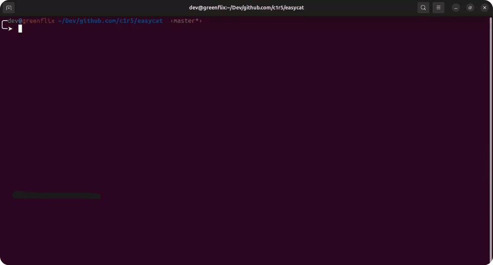

# easycat

`easycat` is a fast terminal UI for Android `logcat` debugging through ADB.

It helps you:

- list connected Android devices
- list installed packages for the selected device
- stream `logcat` in real time
- filter logs by text, level, and PID
- pause, clear, and navigate logs without leaving the terminal

## Installation

### Requirements

- Go
- ADB available in your `PATH`
- An Android device or emulator with USB debugging enabled

Check ADB:

```sh
adb devices -l
```

Install with Go:

```sh
go install github.com/c1r5/easycat@latest
```

Make sure `$(go env GOPATH)/bin` is available in your `PATH`.

Install dependencies:

```sh
make deps
```

Build the binary:

```sh
make build
```

The binary will be created at:

```sh
bin/easycat
```

## Running

Run from source:

```sh
go run .
```

Run the built binary:

```sh
./bin/easycat
```

Development mode with hot reload:

```sh
make dev
```

`make dev` uses `cargo watch`, so install it first if needed:

```sh
cargo install cargo-watch
```

## Shortcuts

| Key | Action |
| --- | --- |
| `tab` / `shift+tab` | Change focused panel |
| `enter` | Select device or app |
| `/` | Focus text filter |
| `esc` | Leave text filter |
| `up` / `down` | Move selection or scroll |
| `pgup` / `pgdown` | Scroll logcat |
| `g` / `G` | Go to top / bottom |
| `l` | Cycle log level filter |
| `o` | Toggle PID-only filter |
| `r` | Refresh devices |
| `c` | Clear logs |
| `p` | Pause / resume rendering |
| `q` | Quit |

## Demo


